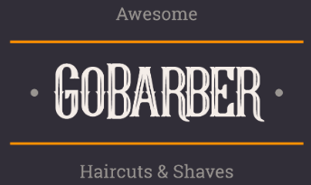
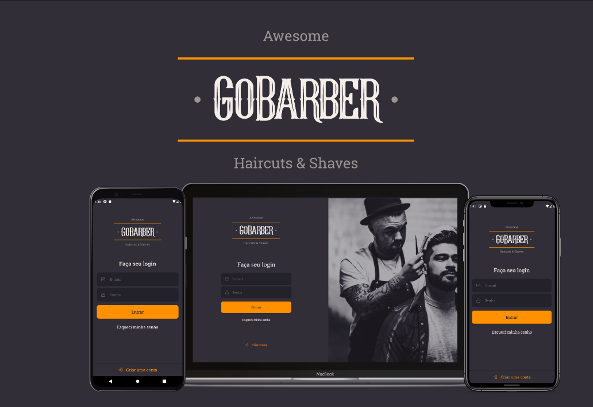

<h1 align="center">
    
</h1>

<h3 align="center">
  🪒 GoBarber 2.0 💈
</h3>

## 🔍 Sobre

Uma aplicação desenvolvida na nova jornada do GoStack, que a parte mobile tem como finalidade ser uma aplicativo para que os clientes da barbearia consiga agendar horarios com os prestadores de serviço. Este aplicativo foi desenvolvido utilizando <a href="https://reactnative.dev/">React Native</a> e <a href="https://www.typescriptlang.org/">TypeScript</a> com varios padrões de arquitetura de software para que o código e a estrutura de pastas fique mais facil.

## 🔗 Conjunto da obra

  -  <strong> <a href='https://github.com/nelsonplinio/GoBarber2.0-back-end'> API GoBarber  </a> </strong> - Feita em node.JS e Typescript

-  <strong> <a href='https://github.com/nelsonplinio/GoBarber2.0-front-end'> Web GoBarber  </a> </strong> - Feita em React Js e Typescript

## ⚙️ Oque foi utilizado

  - React Native
  - React hooks
  - TypeScript
  - unform
  - react-native-permissions
  - Axios
  - polished
  - eslint
  - prettier
  - styled-components
  - react-native-vector-icons
  - react-navigation
  - yup
  - react-native-iphone-x-helper
  - react-native-image-picker
  - datetimepicker
  - async-storage
  - date-fns

## 📷 Imagens

## 🚀 Instalar e usar

###### Clone o respostiorio.
``git@github.com:nelsonplinio/GoBarber2.0-mobile.git``

###### Instalar as dependencias.
``cd GoBarber2.0-mobile ``
`` yarn ou npm install``

###### Instalar as dependencias.
``yarn start ou npm run start ``
